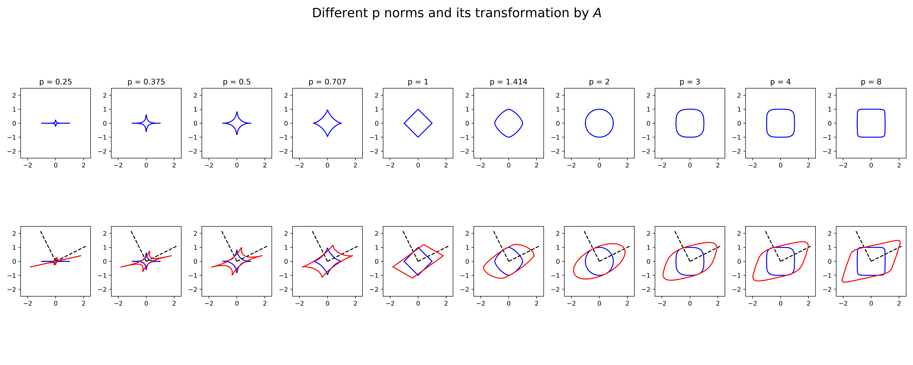

# Unit Ball

A unit ball is the closed set of points of distance less than or equal to constant radius from the center.
A general norm ellipsoid in $R^{n}$ is the set generated by a norm ball, for any norm $\lVert  . \rVert$, of radius r, centered at Xc, and transformed by any symmetric matrix $A$ $>$ 0:

- $E = \\{x = X_{c} + Au \mid \lVert u \rVert_{p} < 1, A > 0 \\}$  
  
  - The Ellipsoide is a spical case where p = 2   

- $A$ $=$ $λ_{1}$ $v_{1}$ $v_{1}\intercal$ $+$ $λ_{2}$ $v_{2}$ $v_{2}\intercal$

- #### Assume the center of the unit-ball is in the origin (0,0).

- #### So, we have all points on the unit-ball with the same p-norm (L).

- #### The unitball therefore describes all points that have "distance" L from the origin, where "distance" is measured by the p-norm.

## Results

</img>
